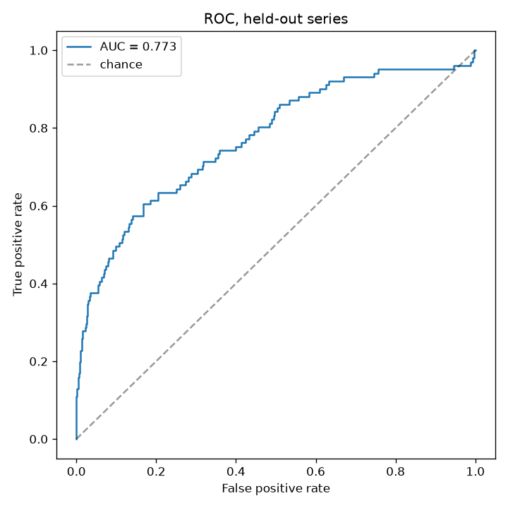
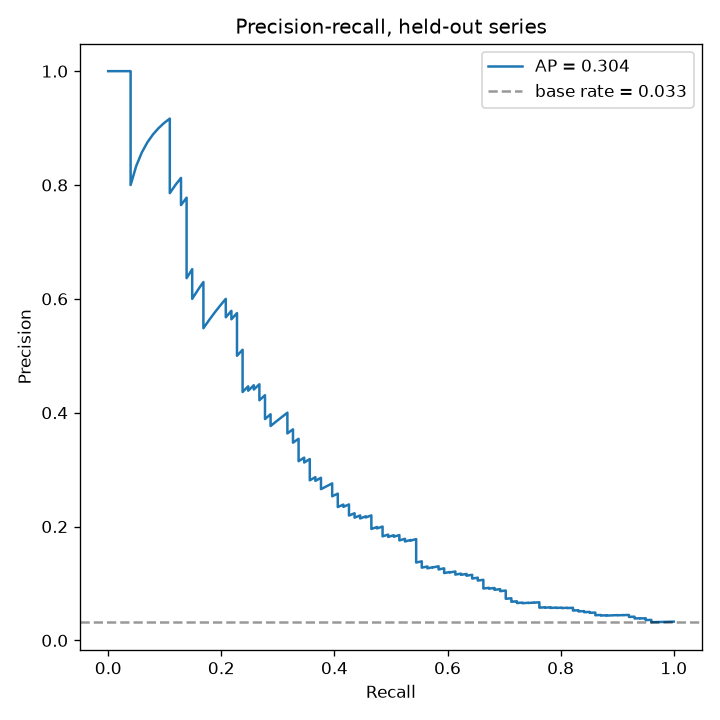
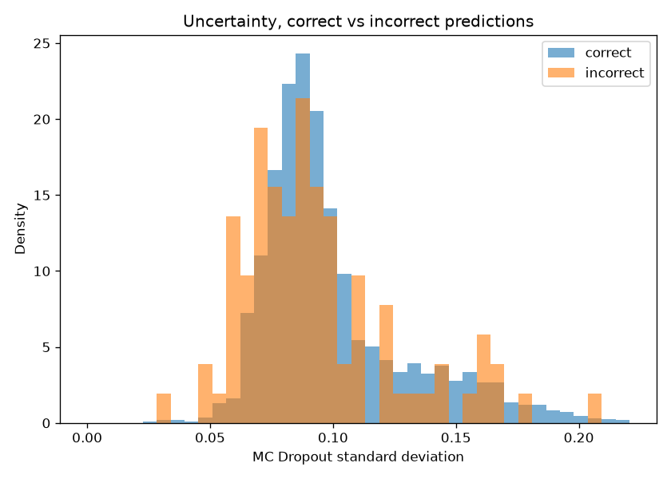
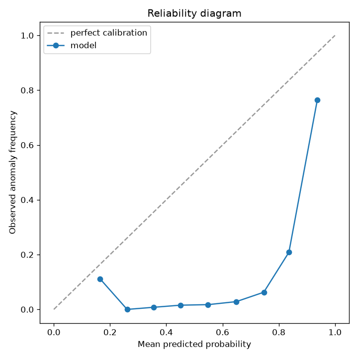

# Chrono-Sentinel

[](https://github.com/JonesRobM/Chrono-Sentinel/actions/workflows/ci.yml)
[](https://github.com/JonesRobM/Chrono-Sentinel/actions/workflows/release.yml)
[](https://github.com/JonesRobM/Chrono-Sentinel/pkgs/container/chrono-sentinel)
[](https://www.python.org/)
[](https://github.com/astral-sh/ruff)
[](LICENSE)

Anomaly detection on time series, with an uncertainty estimate, served as a
containerised HTTP API that reports its own latency, throughput and drift.

A transformer trained on the [Numenta Anomaly Benchmark](https://github.com/numenta/NAB)
scores a window of points. Monte Carlo Dropout puts an interval around each
score. `/metrics` tells you whether the traffic still looks like the data the
model was trained on.

Run it without cloning anything:

```bash
docker run --rm -p 7860:7860 ghcr.io/jonesrobm/chrono-sentinel:0.2.2
```


| Payload | Shape | Score |
| --- | --- | ---: |
| `examples/flat_window.json` | constant | 0.17 |
| `examples/noisy_window.json` | high variance, no level shift | 0.32 |
| `examples/step_change.json` | level shift | 0.93 |

| | |
| --- | --- |
| **Model** | Transformer + statistical-feature branch, 72k params, MC Dropout |
| **Test performance** | ROC-AUC 0.77, average precision 0.25 against a 0.033 base rate, three held-out NAB series |
| **Serving** | FastAPI, ~9 ms p50, peak ~820 req/s at concurrency 8 |
| **Image** | 1.35 GB, CPU-only torch, non-root, ~1 s to ready |
| **Observability** | Prometheus latency, throughput, score distribution, PSI drift |
| **Pipeline** | Locked dependencies, lint + tests + container smoke test in CI, GHCR on tag |

Every number here came out of a script in this repo. Anything not yet measured
says so. There's a [What doesn't work](#what-doesnt-work) section and it isn't
empty — the uncertainty interval, which is the headline feature, doesn't do the
job you'd hope it does.

---

## Quick start

```bash
uv venv --python 3.12 && source .venv/bin/activate
uv pip install -r requirements.lock && uv pip install -e . --no-deps

python scripts/fetch_data.py        # ~2.7 MB, only the 12 NAB series used
python scripts/train.py             # reproduces the shipped checkpoint exactly
python scripts/evaluate.py
python scripts/build_reference.py

uvicorn threatsim.serving.app:app --port 8077
```

---

## Results

### Latency

Measured with `scripts/loadtest.py` on an Apple M5 Pro (15 cores), macOS 26.6.2,
one uvicorn worker, `CHRONO_TORCH_THREADS=1`, window size 50, 1000 requests
after 100 discarded warm-ups. Run-to-run variance is around 10%, so read these
to one significant figure.


What the Monte Carlo sample count costs, at concurrency 8:

| `mc_samples` | p50 | p99 | throughput |
| ---: | ---: | ---: | ---: |
| 2 | 7.9 ms | 20.8 ms | 930 req/s |
| 10 | 8.5 ms | 16.5 ms | 913 req/s |
| 30 *(default)* | 10.4 ms | 22.9 ms | 715 req/s |
| 100 | 16.9 ms | 22.4 ms | 470 req/s |

Fifty times the samples costs roughly twice the latency, because the passes are
folded into one batched forward pass rather than looped.

Concurrency, at `mc_samples=30`, 800 requests after 80 warm-ups:

| concurrency | p50 | p95 | p99 | max | throughput |
| ---: | ---: | ---: | ---: | ---: | ---: |
| 1 | 4.1 ms | 4.5 ms | 5.5 ms | 6.7 ms | 243 req/s |
| 2 | 4.9 ms | 5.7 ms | 6.4 ms | 7.3 ms | 405 req/s |
| 4 | 5.5 ms | 6.9 ms | 7.7 ms | 8.5 ms | 713 req/s |
| **8** | **9.4 ms** | **13.9 ms** | **16.7 ms** | 23.9 ms | **816 req/s** |
| 16 | 15.7 ms | 121.6 ms | 248.7 ms | 435.6 ms | 470 req/s |
| 32 | 75.1 ms | 431.5 ms | 615.1 ms | 988.8 ms | 238 req/s |

Throughput peaks at 8 and falls off a cliff after. Past the core count requests
queue, and the tail goes first: at concurrency 32 the median is still 75 ms
while the 99th percentile is 615 ms.

There's no hosted-endpoint row: this project ships a container, not a URL (see
[Deployment](#deployment)). `scripts/loadtest.py --url <host>` gives you the
same table against anything you deploy it to.

### MC Dropout batching

`scripts/bench_batching.py`, single-threaded, 300 iterations after 50 discarded,
HTTP excluded:

| `mc_samples` | sequential loop | batched | speedup |
| ---: | ---: | ---: | ---: |
| 10 | 1.70 ms | 0.82 ms | 2.1x |
| 30 | 5.15 ms | 2.27 ms | 2.3x |
| 100 | 17.53 ms | 7.46 ms | 2.4x |

Independent dropout masks mean the two can't match sample-for-sample, but they
must agree on what those samples estimate. Over 300 seeded draws at `n=30` the
mean differs by 0.0003 and sigma by 1.1%. `tests/test_models.py` pins that — a
faster function that quietly changes the uncertainty semantics is a bug.

### Model quality

Test is three NAB series never seen in training: `machine_temperature_system_failure`,
`rds_cpu_utilization_cc0c53`, `elb_request_count_8c0756`. 3063 windows, 3.3%
anomalous. Reproduce with `python scripts/evaluate.py`.

| method | val AP | val AUC | test AP | test AUC |
| --- | ---: | ---: | ---: | ---: |
| **Transformer + MC Dropout** | 0.160 | 0.599 | **0.254** | 0.773 |
| Logistic regression, 10 features | 0.255 | 0.640 | 0.167 | **0.786** |
| Logistic regression, z-scored sequence | 0.038 | 0.442 | 0.032 | 0.517 |
| Always-anomaly | 0.044 | 0.500 | 0.033 | 0.500 |

Average precision is the headline: at a 3.3% base rate ROC-AUC rewards ranking
across a huge negative majority, while AP tracks how well the few positives get
surfaced. The transformer manages 7.7x the base rate. At the threshold that
maximises F1 on validation (0.66, never tuned on test): precision 0.10, recall
0.60, F1 0.17.

Logistic regression on ten statistical features is genuinely competitive and
wins on test ROC-AUC. A transformer that couldn't beat it wouldn't be worth
serving.

| | |
| :-: | :-: |
|  |  |

---

## What doesn't work

**The uncertainty interval doesn't identify errors.** Using sigma to rank which
predictions are wrong gives an AUC of 0.54, against 0.5 for a coin flip. Mean
sigma is 0.1024 on correct predictions and 0.1033 on incorrect ones.



The two distributions sit on top of each other. Sigma does respond to the input
— 0.028 to 0.262 across the test set, coefficient of variation 0.33 — so it's a
real measurement. It's measuring how much dropout perturbs a prediction, not how
likely that prediction is to be wrong.

**The probabilities are badly calibrated.** Expected Calibration Error is 0.46.
Training uses `pos_weight=28.4` to counter the class imbalance, which inflates
predicted probabilities well above the 3.3% base rate. Threshold the scores;
don't read them as probabilities.



**MC Dropout doesn't reliably improve accuracy.** It's there for the interval,
and the ~2.3x latency it costs buys nothing dependable in ranking quality:

| split | mode | AUC | AP |
| --- | --- | ---: | ---: |
| val | deterministic | 0.557 | 0.335 |
| val | MC Dropout, n=30 | 0.555 | 0.160 |
| test | deterministic | 0.755 | 0.246 |
| test | MC Dropout, n=30 | 0.776 | 0.275 |

Averaging helps test AP and halves validation AP. The checkpoint is also
selected on *deterministic* validation AP but served with MC averaging, so
selection and deployment aren't quite measuring the same thing.

**Seed variance is large.** Best validation AP across five seeds: 0.212, 0.245,
0.267, 0.335, 0.338. Any single-run difference below about 0.1 AP on this
dataset is noise, including differences quoted above.

**Evaluation is stochastic**, so it's seeded (`--seed`, default 42). On an
identical checkpoint, unseeded runs moved the error-detection AUC between 0.43
and 0.56, because the F1 threshold comes from sampled validation scores.

---

## Fixing the detector

The checkpoint this repo originally shipped scored **ROC-AUC 0.481** — worse
than chance. It called every window an anomaly, and its MC Dropout sigma was a
flat 0.021 whatever the input, so the interval was decorative.

Five causes, all fixed, all now guarded by `tests/test_data.py`:

1. **The split wasn't a split.** `get_dataloaders` concatenated every series
   and *then* split by time. One series was 5.6x longer than the other, so both
   boundaries landed inside it: train and validation were 100% machine
   temperature, test 100% EC2 CPU. It looked like 70/15/15 and was an
   out-of-distribution transfer test. Splits are now **grouped by series**,
   keeping positive rates comparable (3.4% / 4.4% / 3.3%).

2. **The labels were ~43x too narrow.** The old mask marked ±30 wall-clock
   minutes per annotation — ±6 samples at NAB's 5-minute rate. NAB's own
   convention is a window totalling a fraction of the series length, split
   across its anomalies: 567 points for machine temperature. That left roughly
   11 positive training windows to learn from.

3. **Per-window z-scoring erased the signal.** Zeroing each window's mean and
   variance throws away level and scale, which is what a machine-temperature
   failure looks like. It can't just be dropped — the service gets a bare
   window with no series identity, so preprocessing must be a pure function of
   that window, and a global scaler is worse still (AUC 0.125; the series span
   means from 0.1 to 87). The fix keeps z-scoring for the sequence and **adds a
   feature branch** of ten statistical features, scaled by a `FeatureScaler`
   fitted on train and stored in the checkpoint.

4. **`nn.BCELoss` on a sigmoid output** with a hand-applied weight, rather than
   `BCEWithLogitsLoss(pos_weight=...)` on logits.

5. **Selection on validation loss.** At a 3% positive rate the loss is
   dominated by the negative class, so a model that collapses to the prior
   posts a respectable one. Selection is now on validation average precision.

Two smaller findings: `ReduceLROnPlateau` *hurt* (validation AP 0.335 → 0.227 on
seed 42, halving the rate during dips the run recovers from), so it's opt-in;
and training defaults to CPU, because MPS numerics shifted results enough that a
sweep and a training run disagreed on identical settings.

`python scripts/train.py` with no flags reproduces the shipped checkpoint
byte-for-byte (sha256 `711eac756d17…`).

---

## API

| Endpoint | Purpose |
| --- | --- |
| `POST /score` | Score one window; returns score, interval, model version, inference time |
| `GET /healthz` | Liveness. Doesn't touch the model |
| `GET /readyz` | Readiness, plus model version and expected window size. 503 until loaded |
| `GET /drift` | Population drift against the training reference |
| `GET /metrics` | Prometheus exposition |

Liveness and readiness are separate because loading the checkpoint takes long
enough that a combined probe would report a crash loop during a slow cold start.

`POST /score` takes `values` (exactly the model's window size — check `/readyz`)
and an optional `mc_samples` between 2 and 200. Both multiply into inference
cost, so both are bounded. A wrong-length window gets a 422 rather than being
padded, because silently reshaping the input would return a confident score for
something the caller never asked about.

Payloads for all three example shapes are in [`examples/`](examples/).

---

## Observability

`/metrics` answers the four questions you actually ask of a deployed model:

| Question | Metric |
| --- | --- |
| How much traffic? | `chrono_requests_total{endpoint,status}` |
| How fast? | `chrono_request_latency_seconds`, `chrono_inference_latency_seconds` |
| What's it saying? | `chrono_anomaly_score`, `chrono_uncertainty_std` |
| Is it still valid? | `chrono_drift_psi{feature}`, `chrono_drift_max_psi` |

Buckets are tuned for a CPU forward pass in the single-to-tens of milliseconds;
the `prometheus_client` defaults start at 5 ms and would put nearly everything
in one bucket. No label is client-controlled — an unmatched route reports
`endpoint="unmatched"` rather than letting a caller mint unbounded series.

### Drift

`scripts/build_reference.py` records how the model's inputs and outputs were
distributed **on the training split only**. The service keeps a rolling buffer
of recent requests and reports the Population Stability Index against that
reference, per feature and for the score distribution.

```
PSI < 0.10   stable
0.10 - 0.25  moderate
PSI > 0.25   significant
```


Synthetic traffic looks nothing like NAB, so every feature reports
`significant`. That's the detector working.

The reference is never rebuilt from live traffic — it would drift along with
the data and report stability while the model went stale, which is the failure
it exists to catch. PSI stays hidden below 50 observations, where it's just
binning noise.

`tests/test_reference.py` checks both directions: below 0.10 on an unshifted
sample, above 0.25 on a three-sigma shift, on a variance change alone, and on
an output-only collapse with inputs held fixed.

All three recordings render from committed [VHS](https://github.com/charmbracelet/vhs)
scripts (`vhs docs/demo.tape`), so they regenerate instead of rotting the way
screenshots do.

---

## Architecture

```
Raw window (50 points)
    |
    +-- per-window z-score ------> Transformer encoder (2 layers, 4 heads, d=64)
    |                                        |
    |                                   mean pooling
    |                                        |
    +-- 10 statistical features ---> feature MLP
        (scaled by the checkpoint's                 |
         FeatureScaler)                    concatenate
                                                    |
                                          classifier -> logit
                                                    |
                                       30x stochastic passes
                                                    |
                                        mean = score, sd = uncertainty
```

72,129 parameters. Both preprocessing paths are pure functions of the incoming
window plus constants from the checkpoint, so training and serving apply
identical transforms.

Dropout is switched on once at load and never toggled. Toggling per request
needs a lock — one request's exit would disable dropout mid-forward-pass in
another and silently collapse its uncertainty to zero — and that lock would
serialise every forward pass. Left on, scoring mutates no shared state, `/score`
runs on FastAPI's threadpool, and requests genuinely overlap. That's what the
concurrency table measures.

---

## Deployment

Actions builds and pushes to GHCR on every `v*` tag. The published image is the
deliverable: a public, immutable tag anyone can run.

```
git tag v0.2.2  ->  release.yml  ->  ghcr.io/jonesrobm/chrono-sentinel:0.2.2
                                              |
                                docker run -p 7860:7860 <tag>
```

**There's no hosted demo, and that's deliberate.** The plan was a free Hugging
Face Space on the Docker SDK. As of 2026-08-31 that isn't free: Hugging Face
requires PRO for Gradio or Docker Spaces and returns `402 Payment Required`.
Every other free container host I checked has since withdrawn its free compute
tier or wants a card. A public image beats a dead URL.

Four things about the release chain are easy to get wrong; `release.yml` handles
all four:

- **No leading `v` on the published tag.** A git tag of `v0.2.2` publishes
  `0.2.2` — `metadata-action`'s `{{version}}` strips it.
- **No `:latest`.** `metadata-action` adds it by default on a semver push, so
  the workflow sets `flavor: latest=false`. A floating tag would make the
  numbers above unattributable to any particular image.
- **The GHCR package is private by default**, even for a public repo, and only
  exists after a successful push. Check it the way an anonymous puller would:

  ```bash
  curl -s "https://ghcr.io/token?scope=repository:jonesrobm/chrono-sentinel:pull&service=ghcr.io"
  ```

  Public returns `{"token":"..."}`; private or absent returns `DENIED`.
- **`linux/amd64` only.** Pulling on Apple Silicon needs `--platform linux/amd64`.

torch comes from the CPU wheel index: the default Linux wheel declares seven
CUDA requirements for a service that never sees a GPU. ONNX isn't an
alternative, since MC Dropout needs dropout live at inference and export folds
it away.

| image | arch | size |
| --- | --- | ---: |
| full research requirements | arm64, local | 1.87 GB |
| **runtime requirements only** | **arm64, local** | **1.35 GB** |
| **published release image** | **amd64, GHCR** | **1.48 GB** |

The service needs numpy and torch, not pandas, matplotlib, scikit-learn, scipy
or seaborn. Those were arriving via the package `__init__`, so it now resolves
exports lazily (PEP 562) and the image installs `requirements-runtime.lock`.
Worth 520 MB. torch is 635 MB of the remaining 873 MB, near the floor without
dropping the framework entirely.
`tests/test_serving.py::TestImportFootprint` guards it — one module-level import
would undo the lot.

Cold start from `docker run` to `/readyz` is **1.14 s** on a native arm64 build.
The published amd64 image has been pulled anonymously and run end to end,
reporting the same `model_version` as the local checkpoint. No latency is quoted
from that run: it was under x86 emulation, which measures the emulator.

---

## Layout

```
threatsim/
  data.py           NAB loading, labelling, grouped splits
  features.py       10 statistical window features
  models.py         Transformer + batched MC Dropout
  reference.py      Drift profile and PSI
  scaling.py        FeatureScaler, kept free of heavy imports
  utils.py          Seeding, checkpoint IO, plots
  serving/          FastAPI app, inference, metrics, schemas
scripts/
  fetch_data.py         Download only the NAB series used
  train.py / evaluate.py
  build_reference.py    Drift reference from the training split
  loadtest.py           Latency and throughput
  bench_batching.py     MC Dropout batching speedup and equivalence
  make_examples.py      Regenerates examples/ from the checkpoint
  lock_requirements.sh  Regenerates the dependency locks
examples/           Ready-to-POST request payloads
docs/               VHS tapes and the recordings they render
tests/              75 tests
.github/            CI (lint, tests, image smoke test), release to GHCR, Dependabot
pyproject.toml      Packaging, ruff and pytest config
requirements.lock   Fully-pinned graph for CI; requirements-runtime.lock for the image
```

torch is deliberately absent from both lock files — its PyPI metadata drags in
nineteen CUDA packages on Linux. It's installed separately from the CPU wheel
index, and `scripts/lock_requirements.sh` fails loudly if CUDA ever appears.

## Reproducing everything

```bash
python scripts/fetch_data.py
python scripts/train.py                  # byte-identical checkpoint
python scripts/evaluate.py               # quality table, "what doesn't work"
python scripts/build_reference.py
python scripts/bench_batching.py

uvicorn threatsim.serving.app:app --port 8077 &
python scripts/loadtest.py --requests 1000 --concurrency 8 --warmup 100 --sweep-mc 2,10,30,100

pytest -q                                # 75 tests
ruff check . && ruff format --check .    # the CI lint gate
```

Latency figures are machine-specific; the conditions are stated so a rerun
elsewhere is comparable rather than merely different.

## Limitations

- NAB is 12 series at one sample every five minutes. Nothing here has been
  tested on higher-frequency or multivariate data.
- Univariate only. `/score` takes one channel.
- One model. No A/B path, no shadow scoring, no automatic retraining when drift
  fires — `/drift` reports, a human decides.
- Drift lives in an in-memory buffer, so it resets when the container restarts.

## Licence

MIT.
